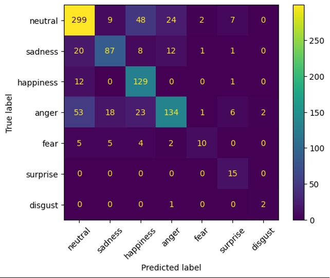

# Model Card for BERT-based Emotion Classifier

## 1. Model Overview
This model is a fine-tuned BERT-based classifier designed to detect emotions from translated media content. It processes transcribed Bulgarian video content, translates it to English, and classifies the resulting text into various emotional categories. The model supports media analysis by providing deep insights into emotional tone, focusing on intense emotions and neutrality.

## 2. Architecture
- **Base Model**: BERT model from Hugging Face.  
- **Fine-Tuning Dataset**: 460,000 sentences used for pre-training.  
- **Iterations**: The model underwent 6 training iterations for optimization.  
- **Technical Details**:  
  - [Include additional technical specifications and design choices here...]

## 3. Purpose
- **Primary Goal**: To process a transcribed Bulgarian video, translate it to English, and classify the resulting text into emotions focused on intense emotions and neutrality.  
- **Use Case**: Targeted for media analysis that requires deep emotional understanding, which addresses specific client needs.

## 4. Development Context
- **Training Data**: 460,000 sentences from a diverse corpus.  
- **Test Data**: Clean and combined datasets including GoEmotion, MELD, and CARER.  
- **Evaluation Metric**:  
  - F1 Weighted Score: 71  
    *(Weighted score is used due to significant class imbalances, especially in the 'disgust' category.)*

## 5. Intended Use
- **Target Applications**:  
  - Designed for classifying intense emotions and neutral states in translated media content.
  - **Usage Consideration**: Based on confusion matrix analysis, the model should ideally avoid misclassifying 'disgust' and 'fear'.  
- **Confusion Matrix**:

  
- **Further Information**:  
  - Detailed [error analysis](https://github.com/BredaUniversityADSAI/2024-25c-fai2-adsai-group-team-24-y2c/blob/7dc19b6d28ccb448be34eb34646ed67dab493105/Error_Analysis.docx) is available.

<!-- Dataset Details -->
## 6. Dataset Details
| Dataset     | Content                          | Size                        | Emotion categories                   | Annotation method | Balanced |
|-------------|----------------------------------|-----------------------------|-------------------------------------|------------------|-----------|
| GoEmotion (2020)  | English Reddit comments          | 58k comments                | 6 core emotions + neutral                | Manual           | No        |
| MELD (2019)       | Dialogues from the TV show *Friends* | 1,433 dialogues             | 6 core emotions + neutral                | Manual           | No        |
| CARER  (2009)     | English tweets                   | 426,809 tweets              | 6 core emotions                          | Automatic         | No        |

- **Preprocessing Steps:**
  - Removal of duplicates and noise.
  - Standard tokenization and lowercasing.
  - Handling of missing values and minor data augmentation.
- **Multilingual Considerations:**
  - Although primarily in English, the dataset includes translated Bulgarian content, which introduces challenges in preserving cultural and linguistic nuances.

## 7. Performance Metrics and Evaluation
- **Key Metric**:  
  - F1 Weighted Score: 71  
    *(The weighted metric appropriately adjusts for class imbalances.)*
- **Error Analysis**:  
  - Additional insights and detailed breakdowns are documented.  
  - [Error Analysis](https://github.com/BredaUniversityADSAI/2024-25c-fai2-adsai-group-team-24-y2c/blob/7dc19b6d28ccb448be34eb34646ed67dab493105/Error_Analysis.docx)
- **Evaluation Summary:**
  - The model performs comparably or better than traditional machine learning approaches (Naive Bayes, Logistic Regression) and other neural network architectures (RNN, LSTM).

## 8. Explainability and Transparency
- **Traditional Machine Learning**:  
  - Data preprocessing: noise and punctuation removal, tokenization, stemming
  - Text Representation: TF-IDF
  - Classifiers: Naive Bayes & Logistic Regrassion

| Approach             | F1-Score |
|----------------------|----------|
| Naive Bayes          | 0.304   |
| Logistic Regression  | 0.332   |

- **Neural Networks**
  - Data preprocessing: tokenization
  - Word Embeddings: pretrained 300 dimensional GLove
  - Deep Network: RNN, LSTM, BERT

| Approach             | F1-Score |
|----------------------|----------|
| RNN          | 0.34   |
| LSTM        | 0.30   |

- **Transfer Learning with BERT**
  - Finetuning BERT for text classification

| Approach             | F1-Score |
|----------------------|----------|
| BERT          | 0.7102   |

## 9. Recommendations for Use
- **Deployment Guidelines:**
  - Monitor model outputs with periodic error analysis to catch any drift or misclassification.
  - Implement caching and batching strategies to reduce inference overhead.
  - Schedule regular updates with fresh data to maintain model relevance.
- **Operational Risks:**
  - Translation errors can propagate to misclassification.
  - Misclassification between closely related emotions (such as 'disgust' and 'fear') should be handled with caution.
- **Specific Use Cases:**
  - Sentiment analysis for media companies.
  - Enhancing content strategy based on public emotional trends.
  - Informing market research and customer sentiment studies.

## 10. Sustainability Considerations
### Calculation Summary
- **Training Phase**:  
  - Training on 460 sentences for 3 hours using a GPU that consumes 350 W resulted in approximately 0.72 kWh of energy usage.  
    *(Calculation: \( \frac{3 \text{ hours} \times 240 \text{ W}}{1000} \approx 0.72 \text{ kWh} \))*
- **Inference Phase**:  
  - Processing 960 sentences in 8 seconds consumed roughly 0.53 Wh in total, which is about 0.00056 Wh per sentence.  
    *(Calculation: \( \frac{8 \text{ seconds} \times 240 \text{ W}}{3600} \approx 0.53 \text{ Wh} \))*

### Energy Impact Discussion
- Although the training phase used a modest amount of energy, repeated and frequent inferences could lead to a significant overall energy consumption.

### Efficiency Considerations
- To improve sustainability, consider reducing unnecessary inferences through result caching or batching techniques, thereby minimizing redundant energy usage.

### Hardware Optimization
- Training on a GPU with a 350 W power consumption strongly influences the energy usage. Exploring more energy-efficient hardware or optimizing the training procedure (e.g., using early stopping) could further reduce the carbon footprint.

### Final Recommendation
- To balance performance with a greener operational profile, implement strategies that limit excessive inference calls and assess options for more energy-efficient hardware.

## 11. Limitations and Future Work
- **Known Limitations:**
  - Potential misclassification of similar emotions (e.g., 'disgust' vs. 'fear').
  - Dependence on translation quality, which may introduce errors.
  - The dataset's multilingual representation is limited, primarily featuring English with translated segments.
- **Future Improvements:**
  - Expand dataset diversity to include more languages and cultural contexts.
  - Incorporate additional explainability tools for deeper model insights.
  - Explore hybrid architectures to further boost performance.
- **Ethical Considerations:**
  - Maintain transparency on model limitations to prevent misuse.
  - Continually assess the model for fairness and bias, especially in sensitive applications.